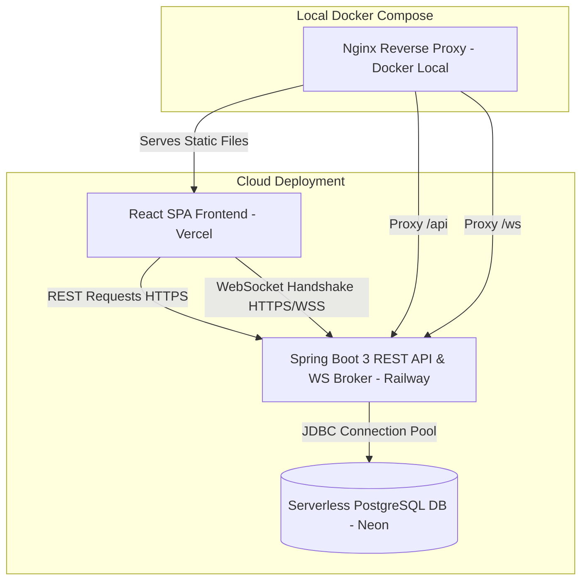
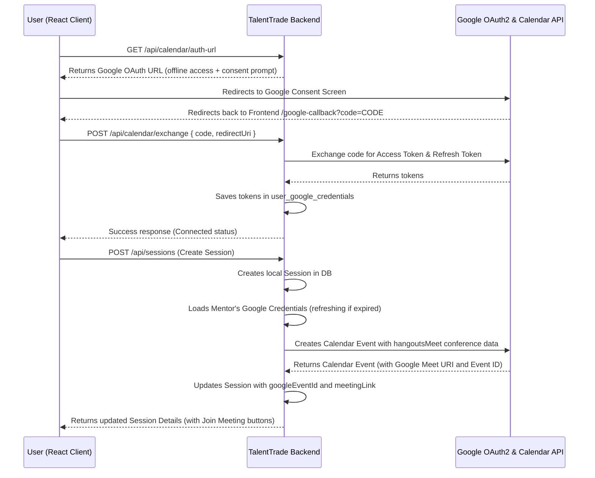
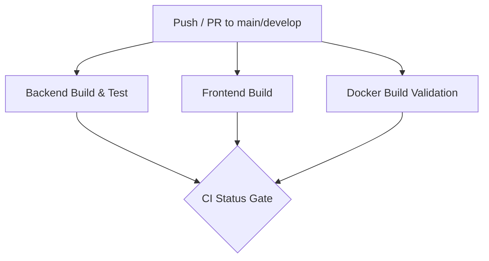

# TalentTrade - Skill Exchange Platform

[](https://github.com/kollisaicharanreddy/TalentTrade-Skill-Exchange-Platform/actions/workflows/ci.yml)


TalentTrade is a production-grade, peer-to-peer skill exchange platform. It empowers users to trade skills they possess (**TEACH**) for skills they want to acquire (**LEARN**) through a non-monetary mutual matching engine, exchange request workflows, virtual scheduling, session feedback, in-app notifications, and secure real-time messaging using WebSockets.

The application is structured into a containerized Java 21 / Spring Boot 3 backend and a modern React / Vite frontend, optimized for cloud deployments.

---

## 🔗 Production Live Demo
* **Frontend Web App**: [https://talent-trade-skill-exchange-platfor.vercel.app](https://talent-trade-skill-exchange-platfor.vercel.app)
* **Backend API (Swagger Docs)**: [https://talenttrade-skill-exchange-platform-production.up.railway.app/swagger-ui.html](https://talenttrade-skill-exchange-platform-production.up.railway.app/swagger-ui.html)
* **WebSocket Endpoint**: [https://talenttrade-skill-exchange-platform-production.up.railway.app/ws](https://talenttrade-skill-exchange-platform-production.up.railway.app/ws)

---

## 🏗️ Production Architecture



In production:
1. **Frontend**: The React client is built as static files and deployed to **Vercel** CDN for fast delivery.
2. **Backend**: The Spring Boot microservice is packaged as a lightweight Docker container and deployed to **Railway**.
3. **Database**: PostgreSQL is hosted in **Neon** providing managed, serverless storage with automated scaling.
4. **WebSocket Communication**: Client browsers bypass static servers and establish direct connections with the Spring Boot Broker on Railway using authenticated STOMP/SockJS protocols.

---

## 🛠️ Technology Stack

### Backend
* **Core Framework**: Java 21 & Spring Boot 3.3.2
* **Database Access**: Spring Data JPA & Hibernate 6
* **Security & Authentication**: Spring Security & stateless JWT tokens (JJWT `0.11.5`)
* **Real-Time Communication**: Spring Message Broker, STOMP Protocol, SockJS
* **API Documentation**: OpenAPI Spec / Swagger UI (`springdoc-openapi`)
* **Build Tool**: Maven

### Frontend
* **Core Framework**: React 18 & Vite
* **Styling**: Tailwind CSS & PostCSS
* **HTTP Client**: Axios (configured with auth interceptors)
* **WebSocket Client**: SockJS-Client & StompJS
* **Toasts & UI Alerting**: React-Toastify

---

## 📂 Project Structure

```text
TalentTrade-Skill-Exchange-Platform
├── .env.example                # Config template for environment variables
├── docker-compose.yml          # Container configuration for local deployment
├── Dockerfile                  # Multi-stage Docker build recipe for backend
├── pom.xml                     # Maven project specification
├── src                         # Spring Boot Java source directory
│   └── main/java/com/talenttrade
│       ├── config              # Swagger & WebSocket configurations
│       ├── controller          # REST controllers & message handlers
│       ├── dto                 # Request / Response Data Transfer Objects
│       ├── entity              # JPA database schema mappings
│       ├── exception           # Exception definitions & Global Handler
│       ├── repository          # Database access interfaces
│       ├── security            # JWT utilities & filters
│       └── service             # Business logic layer
└── frontend                    # React SPA source folder
    ├── Dockerfile              # Multi-stage Docker build recipe for Nginx/React
    ├── nginx.conf              # SPA route config & local reverse proxy
    └── src
        ├── contexts            # Auth and WebSocket state providers
        └── services            # REST API endpoints connectors
```

---

## 🗄️ Database Schema

The backend uses PostgreSQL. The database schema contains the following structure:

```sql
-- 1. users Table
CREATE TABLE users (
    id BIGSERIAL PRIMARY KEY,
    full_name VARCHAR(255) NOT NULL,
    username VARCHAR(255) NOT NULL UNIQUE,
    email VARCHAR(255) NOT NULL UNIQUE,
    password VARCHAR(255) NOT NULL,
    bio VARCHAR(1000),
    location VARCHAR(255),
    created_at TIMESTAMP NOT NULL,
    updated_at TIMESTAMP NOT NULL
);

-- 2. skills Table
CREATE TABLE skills (
    id BIGSERIAL PRIMARY KEY,
    name VARCHAR(255) NOT NULL UNIQUE,
    category VARCHAR(255) NOT NULL,
    description VARCHAR(1000)
);

-- 3. user_skills Table
CREATE TABLE user_skills (
    id BIGSERIAL PRIMARY KEY,
    user_id BIGINT NOT NULL REFERENCES users(id) ON DELETE CASCADE,
    skill_id BIGINT NOT NULL REFERENCES skills(id) ON DELETE CASCADE,
    type VARCHAR(50) NOT NULL, -- 'TEACH', 'LEARN'
    level VARCHAR(50) NOT NULL, -- 'BEGINNER', 'INTERMEDIATE', 'ADVANCED', 'EXPERT'
    CONSTRAINT uq_user_skill_type UNIQUE (user_id, skill_id, type)
);

-- 4. matches Table
CREATE TABLE matches (
    id BIGSERIAL PRIMARY KEY,
    user1_id BIGINT NOT NULL REFERENCES users(id) ON DELETE CASCADE,
    user2_id BIGINT NOT NULL REFERENCES users(id) ON DELETE CASCADE,
    match_score INT NOT NULL,
    created_at TIMESTAMP NOT NULL,
    CONSTRAINT uq_match_pair UNIQUE (user1_id, user2_id)
);

-- 5. exchange_requests Table
CREATE TABLE exchange_requests (
    id BIGSERIAL PRIMARY KEY,
    sender_id BIGINT NOT NULL REFERENCES users(id) ON DELETE CASCADE,
    receiver_id BIGINT NOT NULL REFERENCES users(id) ON DELETE CASCADE,
    message VARCHAR(1000),
    status VARCHAR(50) NOT NULL, -- 'PENDING', 'ACCEPTED', 'REJECTED'
    created_at TIMESTAMP NOT NULL
);

-- 6. sessions Table
CREATE TABLE sessions (
    id BIGSERIAL PRIMARY KEY,
    exchange_request_id BIGINT NOT NULL UNIQUE REFERENCES exchange_requests(id) ON DELETE CASCADE,
    mentor_id BIGINT NOT NULL REFERENCES users(id),
    learner_id BIGINT NOT NULL REFERENCES users(id),
    scheduled_date DATE NOT NULL,
    start_time TIME NOT NULL,
    end_time TIME NOT NULL,
    meeting_link VARCHAR(255) NOT NULL,
    status VARCHAR(50) NOT NULL, -- 'SCHEDULED', 'COMPLETED', 'CANCELLED'
    notes VARCHAR(1000),
    created_at TIMESTAMP NOT NULL,
    updated_at TIMESTAMP NOT NULL
);

-- 7. reviews Table
CREATE TABLE reviews (
    id BIGSERIAL PRIMARY KEY,
    session_id BIGINT NOT NULL REFERENCES sessions(id) ON DELETE CASCADE,
    reviewer_id BIGINT NOT NULL REFERENCES users(id),
    reviewee_id BIGINT NOT NULL REFERENCES users(id),
    rating INT NOT NULL,
    comment VARCHAR(1000),
    created_at TIMESTAMP NOT NULL,
    CONSTRAINT uq_session_reviewer UNIQUE (session_id, reviewer_id)
);

-- 8. notifications Table
CREATE TABLE notifications (
    id BIGSERIAL PRIMARY KEY,
    user_id BIGINT NOT NULL REFERENCES users(id) ON DELETE CASCADE,
    title VARCHAR(255) NOT NULL,
    message VARCHAR(1000) NOT NULL,
    type VARCHAR(50) NOT NULL, -- 'REQUEST_RECEIVED', 'REQUEST_ACCEPTED', etc.
    is_read BOOLEAN NOT NULL DEFAULT FALSE,
    created_at TIMESTAMP NOT NULL
);

-- 9. chat_messages Table
CREATE TABLE chat_messages (
    id BIGSERIAL PRIMARY KEY,
    sender_id BIGINT NOT NULL REFERENCES users(id) ON DELETE CASCADE,
    receiver_id BIGINT NOT NULL REFERENCES users(id) ON DELETE CASCADE,
    message VARCHAR(2000) NOT NULL,
    sent_at TIMESTAMP NOT NULL,
    is_read BOOLEAN NOT NULL DEFAULT FALSE
);
```

---

## ⚙️ Environment Variables Dictionary

The application reads configuration from environment variables. An example template is provided in [.env.example](file:///.env.example).

| Variable Name | Purpose / Description | Scope | Local Default Value |
| :--- | :--- | :--- | :--- |
| `SPRING_PROFILES_ACTIVE` | Set spring environment context profile (e.g. `dev`, `prod`). | Backend | `dev` |
| `SPRING_PORT` | Port where backend Tomcat binds to listen. | Backend | `8080` |
| `SPRING_DATASOURCE_URL` | JDBC URL for connection to the PostgreSQL database cluster. | Backend | `jdbc:postgresql://localhost:5432/talenttrade` |
| `SPRING_DATASOURCE_USERNAME`| PostgreSQL Database user name credentials. | Backend | `postgres` |
| `SPRING_DATASOURCE_PASSWORD`| PostgreSQL Database user password. | Backend | `postgres_password` |
| `SPRING_JPA_DDL_AUTO` | Database Schema strategy (`update`, `validate`, `create-drop`).| Backend | `update` |
| `JWT_SECRET` | Secret key used to sign and verify JSON Web Tokens (Hex 256-bit).| Backend | `404E6352...` |
| `JWT_EXPIRATION` | Validity duration of signed token headers (milliseconds). | Backend | `86400000` (24h) |
| `CORS_ALLOWED_ORIGINS` | Comma-separated list of allowed origins. | Backend | `http://localhost:5173,http://127.0.0.1:5173` |
| `VITE_API_BASE_URL` | Base API target URL for frontend HTTP requests. | Frontend | `/api` |
| `VITE_WS_URL` | Target endpoint for SockJS WebSocket handshake negotiations. | Frontend | `/ws` |

---

## 🚀 How to Run

### Method 1: Docker Compose (Local Environment)
Ensures a single-command setup mapping database, API, and UI containers.

1. Create a `.env` file in the root workspace folder copying values from `.env.example`.
2. Execute the build and run command:
   ```bash
   docker compose up --build
   ```
3. Open browser to **`http://localhost`** (port 80) to interact with the application.

### Method 2: Manual Local Boot
1. **PostgreSQL Setup**: Ensure local database server is active, and create the schema:
   ```sql
   CREATE DATABASE talenttrade;
   ```
2. **Setup environment variables** (or copy to `.env`).
3. **Launch Backend**:
   ```bash
   mvn clean compile spring-boot:run
   ```
4. **Launch Frontend**:
   ```bash
   cd frontend
   npm install
   npm run dev
   ```

---

## ☁️ Production Deployment Instructions

### 1. Database Deployment (Neon PostgreSQL)
Neon offers a serverless PostgreSQL instance with auto-scaling capabilities.

1. Navigate to [Neon Console](https://neon.tech/) and sign in.
2. Click **Create Project**, name it `talenttrade`, and select the preferred region.
3. Locate the **Connection String** panel under Dashboard.
4. Copy the connection parameters.
   * **Direct URL** (e.g. `postgres://[user]:[password]@[host]/talenttrade?sslmode=require`)
5. Translate this to the JDBC string for Spring:
   * **URL**: `jdbc:postgresql://[host]:5432/talenttrade?sslmode=require`
   * **Username**: `[user]`
   * **Password**: `[password]`

### 2. Backend Deployment (Railway)
Railway is the preferred platform for deploying Spring Boot Docker microservices.

1. Log into [Railway Console](https://railway.app/).
2. Create a **New Project** and choose **Deploy from GitHub repo**.
3. Select your `TalentTrade-Skill-Exchange-Platform` repository.
4. Open the **Variables** configuration panel for the service and load variables:
   * `SPRING_PROFILES_ACTIVE` = `prod`
   * `SPRING_DATASOURCE_URL` = `jdbc:postgresql://<neon-hostname>:5432/talenttrade?sslmode=require`
   * `SPRING_DATASOURCE_USERNAME` = `<neon-username>`
   * `SPRING_DATASOURCE_PASSWORD` = `<neon-password>`
   * `SPRING_JPA_DDL_AUTO` = `update` *(Set to `update` for first run to auto-generate schema, then update to `validate` for subsequent runs)*
   * `JWT_SECRET` = `<generate-secure-hex-256-bit-key>`
   * `CORS_ALLOWED_ORIGINS` = `https://<your-vercel-domain>.vercel.app`
5. Under service **Settings**, add a **Domain** mapping. Note your backend URL (e.g., `https://talenttrade-backend.up.railway.app`).
6. Railway automatically reads the root `Dockerfile`, executes the Maven multi-stage package, and boots the runtime instance.
7. Verification: Navigate to `https://<backend-domain>/swagger-ui.html` to confirm success.

### 3. Frontend Deployment (Vercel)
Vercel is optimal for hosting static React Vite SPAs.

1. Log into [Vercel](https://vercel.com/) and click **Add New** -> **Project**.
2. Import your GitHub repository.
3. Select the directory framework as **Vite** and target directory as `./frontend` (under Project settings root).
4. Configure **Environment Variables**:
   * `VITE_API_BASE_URL` = `https://<your-railway-backend-domain>.up.railway.app/api`
   * `VITE_WS_URL` = `https://<your-railway-backend-domain>.up.railway.app/ws`
5. Click **Deploy**. Vercel compiles static production assets into `dist/` and hosts them globally.
6. Configure **SPA Fallback Routing**:
   To prevent `404 Not Found` errors when refreshing React pages, create a `vercel.json` file inside the `frontend` folder containing:
   ```json
   {
     "rewrites": [
       { "source": "/(.*)", "destination": "/index.html" }
     ]
   }
   ```

---

## 🐳 Docker Architecture & Command Catalog

For detailed information about container parameters, Docker multi-stage pipeline configuration, Nginx setup, database persistence, and CLI lifecycle logs, refer to the [Docker Lifecycle Command Catalog](#🐳-docker-lifecycle-command-catalog) table in the local guides.

| Operation | Command |
| :--- | :--- |
| **Build & Run Containers** | `docker compose up --build` |
| **Stop Containers** | `docker compose stop` |
| **Restart Services** | `docker compose restart` |
| **View Service Logs** | `docker compose logs -f` |
| **Access PostgreSQL DB Client** | `docker exec -it talenttrade-db psql -U postgres -d talenttrade` |
| **Wipe Containers & Volumes** | `docker compose down -v` |

---

## 🔐 Google OAuth2 Setup Guide

To enable Google OAuth2 authentication in TalentTrade, you must configure a project on Google Cloud Console:

1. **Create a Google Cloud Project**:
   - Visit [Google Cloud Console](https://console.cloud.google.com/).
   - Click the project dropdown and select **New Project**. Name it `TalentTrade`.

2. **Configure OAuth Consent Screen**:
   - Navigate to **APIs & Services** > **OAuth consent screen**.
   - Select **External** and click **Create**.
   - Fill in the application information (App name: `TalentTrade`, Support email, Developer contact email).
   - Under **Scopes**, add `.../auth/userinfo.email` and `.../auth/userinfo.profile`.
   - Add your test user emails to the **Test users** section.

3. **Create Credentials**:
   - Navigate to **APIs & Services** > **Credentials**.
   - Click **Create Credentials** > **OAuth client ID**.
   - Choose **Web application** as application type.
   - Add **Authorized JavaScript origins**:
     - `http://localhost:8080` (Backend API)
     - `http://localhost:5173` (Frontend Local)
   - Add **Authorized redirect URIs**:
     - `http://localhost:8080/login/oauth2/code/google` (Default Spring Security OAuth2 callback redirect)
     - If deployed, add your backend redirect URL e.g., `https://<backend-domain>/login/oauth2/code/google`
   - Click **Create** and copy your **Client ID** and **Client Secret**.

---

## 📧 SMTP Configuration Guide

TalentTrade uses Spring Mail for sending registration verification emails. You can configure it via any SMTP provider (Gmail, Mailtrap, AWS SES, etc.):

### Using Mailtrap (Recommended for Development)
1. Register at [Mailtrap](https://mailtrap.io/).
2. Under **Inboxes** > **SMTP Settings**, choose **Spring Boot**.
3. Copy the host, port, username, and password.

### Using Gmail SMTP
1. Go to your Google Account > **Security**.
2. Enable **2-Step Verification**.
3. Go to **App passwords**, create an App password for "Mail", and copy the generated 16-character password.
4. Set the host to `smtp.gmail.com` and port to `587`.

---

## ⚙️ Required Environment Variables

Add the following properties to your `.env` file or environment configuration:

```env
# Google OAuth2 Credentials
GOOGLE_CLIENT_ID=your-google-client-id
GOOGLE_CLIENT_SECRET=your-google-client-secret

# Mail SMTP Configuration
SMTP_HOST=smtp.gmail.com
SMTP_PORT=587
SMTP_USERNAME=your-email@gmail.com
SMTP_PASSWORD=your-app-password

# Application Settings
APP_URL=http://localhost:8080
```

---

## 🔄 Verification & OAuth2 Authentication Workflow

### Email Verification Flow
1. **User Registration**: Client hits `POST /api/auth/register`. A new user is created in the database with `enabled = false` and `emailVerified = false`.
2. **Token Generation**: A unique UUID token is generated, bound to the user, and saved in the database with a 24-hour expiration date.
3. **Email Dispatched**: An HTML email is compiled using a Thymeleaf template and sent to the user's email address with a link like `${APP_URL}/api/auth/verify?token=XYZ`.
4. **Verification Call**: User clicks the email link. The client hits `GET /api/auth/verify?token=XYZ`.
5. **Account Activation**: The token is validated, user fields `enabled` and `emailVerified` are set to `true`, and the token is purged from the database.

### Google OAuth2 Setup & Flow
To configure Google Sign-In:
1. Go to the **Google Cloud Console** -> API & Services -> Credentials.
2. Create an **OAuth 2.0 Client ID**.
3. Set Authorized Redirect URIs to:
   - Development: `http://localhost:8080/login/oauth2/code/google`
   - Production: `https://<your-backend-url>/login/oauth2/code/google`
4. Set the authorized javascript origins to your frontend URL.
5. In your `.env` or application configuration, provide:
   - `GOOGLE_CLIENT_ID`
   - `GOOGLE_CLIENT_SECRET`
   - `OAUTH2_REDIRECT_URI` (default: `http://localhost:5173/oauth2/redirect`)

#### Google OAuth2 Flow:
1. **Trigger Login**: Client navigates to `/oauth2/authorization/google`.
2. **Consent Dialog**: Google presents the consent screen.
3. **Authorization Code**: Google redirects to backend endpoint `/login/oauth2/code/google`.
4. **User Sync**:
   - If user exists by email, their account is synced/linked (`provider` updated to `GOOGLE`, `enabled` and `emailVerified` set to `true`).
   - If user does not exist, a new account is automatically created (`provider=GOOGLE`, `role=USER`, `enabled=true`, `emailVerified=true`).
5. **JWT Issuance**: `OAuth2AuthenticationSuccessHandler` generates the TalentTrade JWT token containing custom claims (`userId`, `role`, `provider`).
6. **Redirect**: Backend redirects user back to Frontend URL (`${app.oauth2.authorized-redirect-uri}?token=JWT_TOKEN`).

---

## 🔐 Role-Based Access Control (RBAC)
We enforce granular backend role authorization:
* **Roles**:
  * `USER`: Access to normal peer-to-peer activities (Dashboard, Skills Registry, Matches, Requests, Sessions, Reviews, Notifications, Chat Room).
  * `ADMIN`: Access to all user features plus the administrative endpoints `/api/admin/**` (Summary, Analytics, User Registry Management, Skill Catalog Management, System Health).

* **JWT Custom Claims**:
  ```json
  {
    "sub": "john@gmail.com",
    "userId": 1,
    "role": "ADMIN",
    "provider": "GOOGLE"
  }
  ```

* **Backend Protection**:
  Spring Security intercepts `/api/admin/**` ensuring only clients carrying valid JWTs with `ROLE_ADMIN` authority are granted access (`hasRole('ADMIN')`).

---

## 🧪 Testing Foundation

A professional testing foundation has been established for TalentTrade using **JUnit 5**, **Mockito**, and **Spring Boot Test**, utilizing an in-memory **H2 database** configuration for isolation.

### Testing Architecture & Structure
All test classes are organized following Spring Boot best practices in `src/test/java/com/talenttrade/`:
- **Base Configurations**:
  - `BaseIntegrationTest.java`: Abstract parent configuring the Spring application context (`@SpringBootTest`) and database transaction boundaries.
  - `application-test.properties`: Configures test-profile settings, in-memory H2 DB instance, and dummy auth configs.
- **Reusable Utilities**:
  - `TestDataFactory.java`: Reusable mock builder functions for users, skills, sessions, and request objects.
  - `JWTTestHelper.java`: Utility to generate JWT tokens for secure authentication testing.
- **Unit Tests (`service/` & `security/`)**:
  - Mock repositories and external dependencies using Mockito.
  - Comprehensive coverage of happy paths, validation constraints, and exception handling for all core services (`AuthService`, `CustomOAuth2UserService`, `UserService`, `SkillService`, `MatchService`, `ExchangeRequestService`, `SessionService`, `AdminService`).
- **Integration Tests (`integration/`)**:
  - Validates full end-to-end user workflows using simulated application contexts.
  - Workflow coverage includes user signup-to-login, skill management, matching engine execution, request lifecycles, and administrator bootstrap configurations.

---

### How to Run Tests

#### Option 1: Run via Maven (CLI)
To clean compile the application and execute all tests:
```bash
mvn clean test
```

#### Option 2: Run via IDE
- Open the project in IntelliJ IDEA or Eclipse.
- Right-click the `src/test/java` folder.
- Select **Run 'All Tests'** or run individual test classes using the IDE test runner plugin.

---

### Future Testing Roadmap
Future stages of TalentTrade development will introduce:
1. **MockMvc**: For controller-level API endpoint verification, request validation, serialization, and CORS/CSRF behavior.
2. **Testcontainers**: To run integration tests against a real dockerized PostgreSQL container instead of H2.
3. **WireMock**: For stubbing external API dependencies (e.g. Google OAuth user info endpoint simulation).
4. **AssertJ**: For fluent, human-readable assertion writing.
5. **JaCoCo**: To analyze and report test suite code coverage metrics.

---

## 📅 Google Calendar & Meet Integration (Stage 4)

TalentTrade now integrates with Google Workspace APIs to automate scheduling, generate Google Meet links, and handle participant invitations without SMTP/mail setups.

### Google OAuth Scopes Required
1. `https://www.googleapis.com/auth/calendar` - Allows creating, editing, and deleting calendars.
2. `https://www.googleapis.com/auth/calendar.events` - Allows creating and modifying events on calendars.

### Architecture and Flow


### Session Synchronization Rules
* **Create Session**: Automatically schedules a Google Calendar event, attaches both Mentor and Learner as attendees, generates a Google Meet video conference, and updates the local session with the meeting link.
* **Update Session**: Updates date, times, and agendas in Google Calendar.
* **Cancel Session**: Marks the session status as CANCELLED and removes the event from Google Calendar.
* **Delete Session**: Silently deletes the event from Google Calendar before deleting the session record.

---

## 🚀 Continuous Integration (CI) with GitHub Actions

We implement a production-grade CI pipeline using GitHub Actions to maintain high code quality and prevent build/deployment breaks.

### Pipeline Architecture

Our pipeline is organized into modular jobs that run in parallel where possible, with a unified status gate at the end:



1. **Backend Build & Test (`backend-ci`)**:
   - Compiles the Spring Boot project using JDK 21.
   - Automatically caches Maven dependencies in the GitHub actions runner to accelerate build speeds.
   - Runs all unit and integration tests (using the in-memory H2 database).
2. **Frontend Build (`frontend-ci`)**:
   - Sets up Node.js 20 environment.
   - Caches `npm` modules (relative to `frontend/package-lock.json`).
   - Installs dependencies with `npm ci` (clean install).
   - Generates production-ready compiled assets (`npm run build`).
3. **Docker Build Validation (`docker-validation`)**:
   - Leverages Docker Buildx to build and verify both Backend and Frontend images (`Dockerfile` files).
   - Uses GitHub Actions caching (`cache-from` and `cache-to`) for fast incremental image building.
   - The images are not pushed/deployed at this stage (`push: false`), ensuring only code validation occurs.
4. **CI Status Gate (`ci-status-check`)**:
   - Serves as the unified status check. It relies on the completion of the three preceding jobs, serving as a gate for repository branch protection.

---

### How to Monitor & Manage Workflows

#### 1. Viewing Workflow Logs
1. Navigate to the repository on GitHub.
2. Click on the **Actions** tab.
3. Select the latest run of **TalentTrade Continuous Integration** from the list.
4. Click on any job (e.g., `Backend Build & Test` or `Docker Build Validation`) to view real-time logs, build times, and task details.

#### 2. Troubleshooting Failures
* **Backend Build Failure**: Check the logs of the `Compile Backend & Run Tests` step to see if any tests failed or if compilation failed due to syntax errors.
* **Frontend Build Failure**: Review logs under the `Compile & Build Frontend Assets` step. Ensure imports are correct and package installations have no conflicts.
* **Docker Validation Failure**: Check the logs of the `Validate Backend/Frontend Dockerfile Build` steps to check for invalid configuration commands, missing source directories, or base image changes.
* **CI Status Gate Failure**: This gate will only pass when all sub-jobs complete successfully.

#### 3. Rerunning Workflows
1. Inside the workflow run page on GitHub, click the **Re-run jobs** button in the top-right corner.
2. You can choose to:
   - **Re-run all jobs**: Runs the entire CI pipeline again.
   - **Re-run failed jobs**: Re-runs only the specific job that failed, keeping the success state of other completed jobs to save runner minutes.

---

## ⚡ Performance Optimization with Redis Caching (Stage 6)

TalentTrade utilizes Redis to cache expensive database queries, aggregates, and user-specific stats.

### Caching Architecture

We implement a two-level read/write strategy:
1. **Cache-Aside Pattern**: APIs first check Redis. If present (Cache Hit), they return the data immediately. Otherwise (Cache Miss), the database is queried, and the result is written back to Redis.
2. **Write-Through/Eviction Pattern**: Whenever data is modified, the corresponding caches are updated or evicted to prevent stale data.
3. **Graceful Connection Fallback**: If Redis becomes unavailable, a custom `CacheErrorHandler` intercepts the connection errors, logs them as warnings, and seamlessly falls back to the database, ensuring zero downtime.

### Cache Key & TTL Configuration

| Cache Name | Cached Content | TTL | Invalidation / Eviction Triggers |
|---|---|---|---|
| `dashboardStats` | User dashboard statistics | 10 Min | Session created/completed/cancelled, request changes, reviews, user updates |
| `userProfiles` | User profile details | 30 Min | User profile updates, admin status/role changes |
| `matchResults` | User matching page results | 30 Min | Match engine execution, user profile updates, skill mutations |
| `platformAnalytics` | Admin dashboard analytical graphs | 1 Hour | User registration, skill created/deleted, matching, session completion, reviews |
| `dashboardSummary` | Admin dashboard overview metrics | 1 Hour | User registration, skill created/deleted, matching, session completion, reviews |
| `notificationCounts` | Unread user notification count | 5 Min | New notification created, marked as read, marked all as read, or deleted |

### Running Redis Locally

1. **Prerequisites**: Install Docker & Docker Compose.
2. **Start the Caching Tier**:
   ```bash
   docker-compose up -d redis
   ```
3. **Verify Redis Connection**:
   ```bash
   docker exec -it talenttrade-redis redis-cli ping
   # Expected Output: PONG
   ```
4. **Monitor Cache Hits/Misses**:
   Watch application logs for custom markers:
   * `[CACHE HIT]`
   * `[CACHE MISS]`
   * `[CACHE PUT]`
   * `[CACHE EVICT]`
   * `[REDIS ERROR]`
