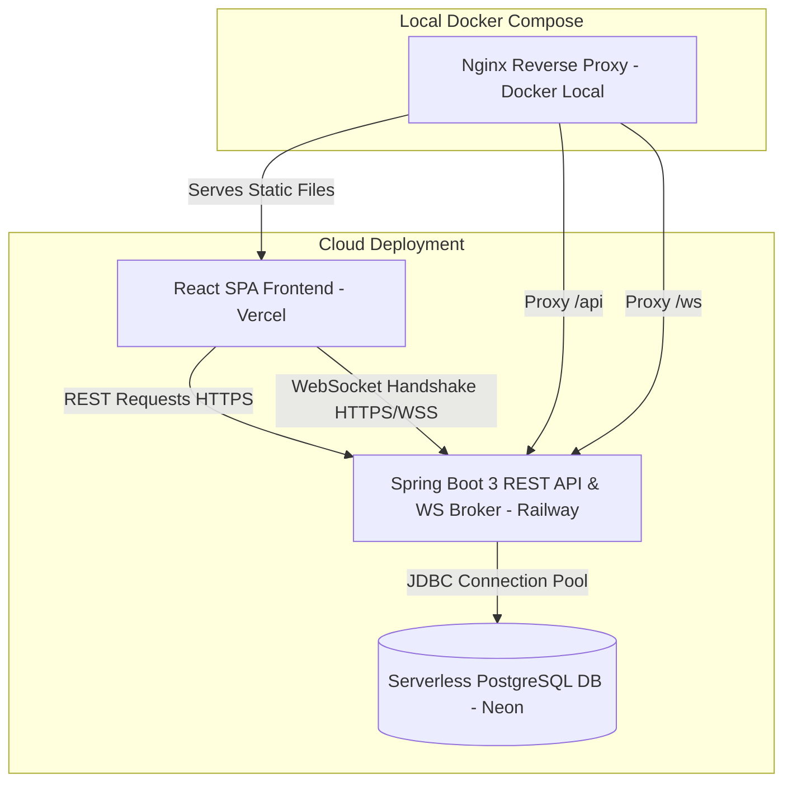

# TalentTrade - Skill Exchange Platform


TalentTrade is a production-grade, peer-to-peer skill exchange platform. It empowers users to trade skills they possess (**TEACH**) for skills they want to acquire (**LEARN**) through a non-monetary mutual matching engine, exchange request workflows, virtual scheduling, session feedback, in-app notifications, and secure real-time messaging using WebSockets.

The application is structured into a containerized Java 21 / Spring Boot 3 backend and a modern React / Vite frontend, optimized for cloud deployments.

---

## 🔗 Production Live Demo
* **Frontend Web App**: [https://talenttrade-frontend.vercel.app](https://talenttrade-frontend.vercel.app)
* **Backend API (Swagger Docs)**: [https://talenttrade-backend.railway.app/swagger-ui.html](https://talenttrade-backend.railway.app/swagger-ui.html)
* **WebSocket Endpoint**: [https://talenttrade-backend.railway.app/ws](https://talenttrade-backend.railway.app/ws)

---

## 🏗️ Production Architecture



In production:
1. **Frontend**: The React client is built as static files and deployed to **Vercel** CDN for fast delivery.
2. **Backend**: The Spring Boot microservice is packaged as a lightweight Docker container and deployed to **Railway**.
3. **Database**: PostgreSQL is hosted in **Neon** providing managed, serverless storage with automated scaling.
4. **WebSocket Communication**: Client browsers bypass static servers and establish direct connections with the Spring Boot Broker on Railway using authenticated STOMP/SockJS protocols.

---

## 🛠️ Technology Stack

### Backend
* **Core Framework**: Java 21 & Spring Boot 3.3.2
* **Database Access**: Spring Data JPA & Hibernate 6
* **Security & Authentication**: Spring Security & stateless JWT tokens (JJWT `0.11.5`)
* **Real-Time Communication**: Spring Message Broker, STOMP Protocol, SockJS
* **API Documentation**: OpenAPI Spec / Swagger UI (`springdoc-openapi`)
* **Build Tool**: Maven

### Frontend
* **Core Framework**: React 18 & Vite
* **Styling**: Tailwind CSS & PostCSS
* **HTTP Client**: Axios (configured with auth interceptors)
* **WebSocket Client**: SockJS-Client & StompJS
* **Toasts & UI Alerting**: React-Toastify

---

## 📂 Project Structure

```text
TalentTrade-Skill-Exchange-Platform
├── .env.example                # Config template for environment variables
├── docker-compose.yml          # Container configuration for local deployment
├── Dockerfile                  # Multi-stage Docker build recipe for backend
├── pom.xml                     # Maven project specification
├── src                         # Spring Boot Java source directory
│   └── main/java/com/talenttrade
│       ├── config              # Swagger & WebSocket configurations
│       ├── controller          # REST controllers & message handlers
│       ├── dto                 # Request / Response Data Transfer Objects
│       ├── entity              # JPA database schema mappings
│       ├── exception           # Exception definitions & Global Handler
│       ├── repository          # Database access interfaces
│       ├── security            # JWT utilities & filters
│       └── service             # Business logic layer
└── frontend                    # React SPA source folder
    ├── Dockerfile              # Multi-stage Docker build recipe for Nginx/React
    ├── nginx.conf              # SPA route config & local reverse proxy
    └── src
        ├── contexts            # Auth and WebSocket state providers
        └── services            # REST API endpoints connectors
```

---

## 🗄️ Database Schema

The backend uses PostgreSQL. The database schema contains the following structure:

```sql
-- 1. users Table
CREATE TABLE users (
    id BIGSERIAL PRIMARY KEY,
    full_name VARCHAR(255) NOT NULL,
    username VARCHAR(255) NOT NULL UNIQUE,
    email VARCHAR(255) NOT NULL UNIQUE,
    password VARCHAR(255) NOT NULL,
    bio VARCHAR(1000),
    location VARCHAR(255),
    created_at TIMESTAMP NOT NULL,
    updated_at TIMESTAMP NOT NULL
);

-- 2. skills Table
CREATE TABLE skills (
    id BIGSERIAL PRIMARY KEY,
    name VARCHAR(255) NOT NULL UNIQUE,
    category VARCHAR(255) NOT NULL,
    description VARCHAR(1000)
);

-- 3. user_skills Table
CREATE TABLE user_skills (
    id BIGSERIAL PRIMARY KEY,
    user_id BIGINT NOT NULL REFERENCES users(id) ON DELETE CASCADE,
    skill_id BIGINT NOT NULL REFERENCES skills(id) ON DELETE CASCADE,
    type VARCHAR(50) NOT NULL, -- 'TEACH', 'LEARN'
    level VARCHAR(50) NOT NULL, -- 'BEGINNER', 'INTERMEDIATE', 'ADVANCED', 'EXPERT'
    CONSTRAINT uq_user_skill_type UNIQUE (user_id, skill_id, type)
);

-- 4. matches Table
CREATE TABLE matches (
    id BIGSERIAL PRIMARY KEY,
    user1_id BIGINT NOT NULL REFERENCES users(id) ON DELETE CASCADE,
    user2_id BIGINT NOT NULL REFERENCES users(id) ON DELETE CASCADE,
    match_score INT NOT NULL,
    created_at TIMESTAMP NOT NULL,
    CONSTRAINT uq_match_pair UNIQUE (user1_id, user2_id)
);

-- 5. exchange_requests Table
CREATE TABLE exchange_requests (
    id BIGSERIAL PRIMARY KEY,
    sender_id BIGINT NOT NULL REFERENCES users(id) ON DELETE CASCADE,
    receiver_id BIGINT NOT NULL REFERENCES users(id) ON DELETE CASCADE,
    message VARCHAR(1000),
    status VARCHAR(50) NOT NULL, -- 'PENDING', 'ACCEPTED', 'REJECTED'
    created_at TIMESTAMP NOT NULL
);

-- 6. sessions Table
CREATE TABLE sessions (
    id BIGSERIAL PRIMARY KEY,
    exchange_request_id BIGINT NOT NULL UNIQUE REFERENCES exchange_requests(id) ON DELETE CASCADE,
    mentor_id BIGINT NOT NULL REFERENCES users(id),
    learner_id BIGINT NOT NULL REFERENCES users(id),
    scheduled_date DATE NOT NULL,
    start_time TIME NOT NULL,
    end_time TIME NOT NULL,
    meeting_link VARCHAR(255) NOT NULL,
    status VARCHAR(50) NOT NULL, -- 'SCHEDULED', 'COMPLETED', 'CANCELLED'
    notes VARCHAR(1000),
    created_at TIMESTAMP NOT NULL,
    updated_at TIMESTAMP NOT NULL
);

-- 7. reviews Table
CREATE TABLE reviews (
    id BIGSERIAL PRIMARY KEY,
    session_id BIGINT NOT NULL REFERENCES sessions(id) ON DELETE CASCADE,
    reviewer_id BIGINT NOT NULL REFERENCES users(id),
    reviewee_id BIGINT NOT NULL REFERENCES users(id),
    rating INT NOT NULL,
    comment VARCHAR(1000),
    created_at TIMESTAMP NOT NULL,
    CONSTRAINT uq_session_reviewer UNIQUE (session_id, reviewer_id)
);

-- 8. notifications Table
CREATE TABLE notifications (
    id BIGSERIAL PRIMARY KEY,
    user_id BIGINT NOT NULL REFERENCES users(id) ON DELETE CASCADE,
    title VARCHAR(255) NOT NULL,
    message VARCHAR(1000) NOT NULL,
    type VARCHAR(50) NOT NULL, -- 'REQUEST_RECEIVED', 'REQUEST_ACCEPTED', etc.
    is_read BOOLEAN NOT NULL DEFAULT FALSE,
    created_at TIMESTAMP NOT NULL
);

-- 9. chat_messages Table
CREATE TABLE chat_messages (
    id BIGSERIAL PRIMARY KEY,
    sender_id BIGINT NOT NULL REFERENCES users(id) ON DELETE CASCADE,
    receiver_id BIGINT NOT NULL REFERENCES users(id) ON DELETE CASCADE,
    message VARCHAR(2000) NOT NULL,
    sent_at TIMESTAMP NOT NULL,
    is_read BOOLEAN NOT NULL DEFAULT FALSE
);
```

---

## ⚙️ Environment Variables Dictionary

The application reads configuration from environment variables. An example template is provided in [.env.example](file:///.env.example).

| Variable Name | Purpose / Description | Scope | Local Default Value |
| :--- | :--- | :--- | :--- |
| `SPRING_PROFILES_ACTIVE` | Set spring environment context profile (e.g. `dev`, `prod`). | Backend | `dev` |
| `SPRING_PORT` | Port where backend Tomcat binds to listen. | Backend | `8080` |
| `SPRING_DATASOURCE_URL` | JDBC URL for connection to the PostgreSQL database cluster. | Backend | `jdbc:postgresql://localhost:5432/talenttrade` |
| `SPRING_DATASOURCE_USERNAME`| PostgreSQL Database user name credentials. | Backend | `postgres` |
| `SPRING_DATASOURCE_PASSWORD`| PostgreSQL Database user password. | Backend | `postgres_password` |
| `SPRING_JPA_DDL_AUTO` | Database Schema strategy (`update`, `validate`, `create-drop`).| Backend | `update` |
| `JWT_SECRET` | Secret key used to sign and verify JSON Web Tokens (Hex 256-bit).| Backend | `404E6352...` |
| `JWT_EXPIRATION` | Validity duration of signed token headers (milliseconds). | Backend | `86400000` (24h) |
| `CORS_ALLOWED_ORIGINS` | Comma-separated list of allowed origins. | Backend | `http://localhost:5173,http://127.0.0.1:5173` |
| `VITE_API_BASE_URL` | Base API target URL for frontend HTTP requests. | Frontend | `/api` |
| `VITE_WS_URL` | Target endpoint for SockJS WebSocket handshake negotiations. | Frontend | `/ws` |

---

## 🚀 How to Run

### Method 1: Docker Compose (Local Environment)
Ensures a single-command setup mapping database, API, and UI containers.

1. Create a `.env` file in the root workspace folder copying values from `.env.example`.
2. Execute the build and run command:
   ```bash
   docker compose up --build
   ```
3. Open browser to **`http://localhost`** (port 80) to interact with the application.

### Method 2: Manual Local Boot
1. **PostgreSQL Setup**: Ensure local database server is active, and create the schema:
   ```sql
   CREATE DATABASE talenttrade;
   ```
2. **Setup environment variables** (or copy to `.env`).
3. **Launch Backend**:
   ```bash
   mvn clean compile spring-boot:run
   ```
4. **Launch Frontend**:
   ```bash
   cd frontend
   npm install
   npm run dev
   ```

---

## ☁️ Production Deployment Instructions

### 1. Database Deployment (Neon PostgreSQL)
Neon offers a serverless PostgreSQL instance with auto-scaling capabilities.

1. Navigate to [Neon Console](https://neon.tech/) and sign in.
2. Click **Create Project**, name it `talenttrade`, and select the preferred region.
3. Locate the **Connection String** panel under Dashboard.
4. Copy the connection parameters.
   * **Direct URL** (e.g. `postgres://[user]:[password]@[host]/talenttrade?sslmode=require`)
5. Translate this to the JDBC string for Spring:
   * **URL**: `jdbc:postgresql://[host]:5432/talenttrade?sslmode=require`
   * **Username**: `[user]`
   * **Password**: `[password]`

### 2. Backend Deployment (Railway)
Railway is the preferred platform for deploying Spring Boot Docker microservices.

1. Log into [Railway Console](https://railway.app/).
2. Create a **New Project** and choose **Deploy from GitHub repo**.
3. Select your `TalentTrade-Skill-Exchange-Platform` repository.
4. Open the **Variables** configuration panel for the service and load variables:
   * `SPRING_PROFILES_ACTIVE` = `prod`
   * `SPRING_DATASOURCE_URL` = `jdbc:postgresql://<neon-hostname>:5432/talenttrade?sslmode=require`
   * `SPRING_DATASOURCE_USERNAME` = `<neon-username>`
   * `SPRING_DATASOURCE_PASSWORD` = `<neon-password>`
   * `SPRING_JPA_DDL_AUTO` = `update` *(Set to `update` for first run to auto-generate schema, then update to `validate` for subsequent runs)*
   * `JWT_SECRET` = `<generate-secure-hex-256-bit-key>`
   * `CORS_ALLOWED_ORIGINS` = `https://<your-vercel-domain>.vercel.app`
5. Under service **Settings**, add a **Domain** mapping. Note your backend URL (e.g., `https://talenttrade-backend.up.railway.app`).
6. Railway automatically reads the root `Dockerfile`, executes the Maven multi-stage package, and boots the runtime instance.
7. Verification: Navigate to `https://<backend-domain>/swagger-ui.html` to confirm success.

### 3. Frontend Deployment (Vercel)
Vercel is optimal for hosting static React Vite SPAs.

1. Log into [Vercel](https://vercel.com/) and click **Add New** -> **Project**.
2. Import your GitHub repository.
3. Select the directory framework as **Vite** and target directory as `./frontend` (under Project settings root).
4. Configure **Environment Variables**:
   * `VITE_API_BASE_URL` = `https://<your-railway-backend-domain>.up.railway.app/api`
   * `VITE_WS_URL` = `https://<your-railway-backend-domain>.up.railway.app/ws`
5. Click **Deploy**. Vercel compiles static production assets into `dist/` and hosts them globally.
6. Configure **SPA Fallback Routing**:
   To prevent `404 Not Found` errors when refreshing React pages, create a `vercel.json` file inside the `frontend` folder containing:
   ```json
   {
     "rewrites": [
       { "source": "/(.*)", "destination": "/index.html" }
     ]
   }
   ```

---

## 🐳 Docker Architecture & Command Catalog

For detailed information about container parameters, Docker multi-stage pipeline configuration, Nginx setup, database persistence, and CLI lifecycle logs, refer to the [Docker Lifecycle Command Catalog](#🐳-docker-lifecycle-command-catalog) table in the local guides.

| Operation | Command |
| :--- | :--- |
| **Build & Run Containers** | `docker compose up --build` |
| **Stop Containers** | `docker compose stop` |
| **Restart Services** | `docker compose restart` |
| **View Service Logs** | `docker compose logs -f` |
| **Access PostgreSQL DB Client** | `docker exec -it talenttrade-db psql -U postgres -d talenttrade` |
| **Wipe Containers & Volumes** | `docker compose down -v` |
